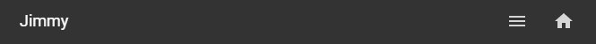

# Homekit Infused

Back to [Addon List](../addon_list.md)

# Footer


### Description
HKI has a footer (v3.6.1 or higher) and has limited customizability, the footer will always comprise out of the logged in user at the bottom left corner and the navigation options to the right of that, these are at least the `home` and `menu` button.
Note that the footer is mostly done through CSS and is just the original tab header that has been moved down. Because of this the options I can give you through this is very very limited!


### Configuration
- To edit the footer you will need to open the `/homekit-infused/user/config/` folder and open the `footer_config.yaml` file.
- The `home` and `menu` buttons are fixed and can not be moved/removed
- You can ONLY set `true` or `false` for each view you want to show
- Icons are placed from right to left, you can NOT change the order of the icons, you can however choose whatever view you want with the exception of settings, user and custom views.
- The settings will be read from top to bottom, see examples below.

### Example
Since the `home` and `menu` buttons are always present I will try to explain how this works
```
  lights_view: false
  devices_view: false
  climate_view: true
  security_view: false
  automations_view: true
```
In the example above you will have a footer in the following order:
`username   -   automations   -   climate   -   menu   -   home`

Remember that I said that the footer should be read from right to left (as opposed to reading from left to right) and that the order of the icons can be read from top to bottom in the config.
In this case this means the climate_view is the first view with the attribute `true` and will be the first icon to show in the footer from right to left. Since the home and menu buttons are fixed, the climate button will appear to the left of those buttons.
It's hard to explain so here is another example
```
  lights_view: true
  devices_view: false
  climate_view: true
  security_view: false
  automations_view: true
```
In the example above you will have a footer in the following order:
`username   -   automations   -   climate   -   lights   -   menu   -   home`

Note that changing the order of the config has NO effect on the order of the footer. Like mentioned before the footer icons can NOT be arranged!
